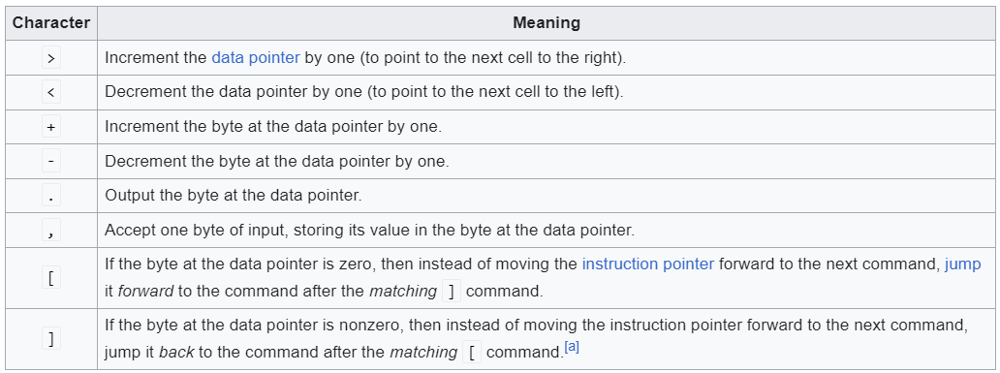

# BF Interpreter in Python

Welcome to the BF Interpreter project! This repository contains a simple and efficient BF interpreter implemented in Python.

## Table of Contents

- [Introduction](#introduction)
- [Features](#features)
- [Installation](#installation)
- [Usage](#usage)
- [Examples](#examples)
- [Contributing](#contributing)
- [License](#license)

## Introduction

BF is an esoteric programming language created in 1993 by Urban Müller. It is known for its minimalistic design, consisting of only eight commands. This interpreter executes BF code, allowing you to experiment with this unique language.

## Features

- Supports all eight BF commands (`>`, `<`, `+`, `-`, `[`, `]`, `.` and `,`).
- Simple and easy-to-understand implementation.
- Error handling for mismatched brackets.
- Command-line interface for executing BF code.

## Installation

To install the BF interpreter, clone this repository to your local machine:

```sh
git clone https://github.com/yourusername/bf-interpreter.git
```

Navigate to the project directory:

```sh
cd bf-interpreter
```

## Usage

To run the BF interpreter, use the following command:

```sh
python bf_interpreter.py path/to/your/bf/code.bf
```

## Examples

Here are some examples of BF code you can run:

### Hello World

```bf
++++++++++[>+++++++>++++++++++>+++>+<<<<-]>++.>+.+++++++..+++.>++.<<+++++++++++++.>++++.-----------.>+.>.
```

To execute the "Hello World" example:

```sh
python bf_interpreter.py examples/hello_world.bf
```

### Fibonacci Sequence

```bf
++++++++++>+>>>>++++++++++++++++++++++++++++++++++++++++++++>++++++++++++++++++++++++++++++++<<<<<<[>[>>>>>>+>
+<<<<<<<-]>>>>>>>[<<<<<<<+>>>>>>>-]<[>++++++++++[-<-[>>+>+<<<-]>>>[<<<+>>>-]+<[>[-]<[-]]>[>+<-]>>[-]]<<+++++++
+++[-<+++++++++++++>]<.[-]<]<]++++[>+++[>++>+++>+++>+<<<<-]>-.>----.+++++.-------.<.[-]<]
```

To execute the Fibonacci sequence example:

```sh
python bf_interpreter.py examples/fibonacci.bf
```

rules of BF:
